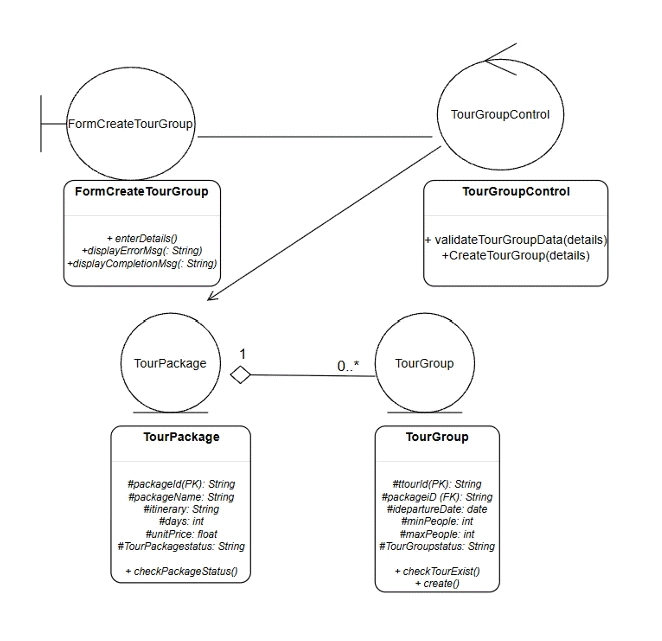
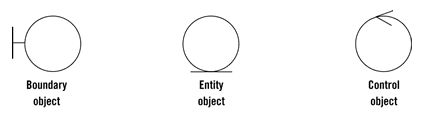
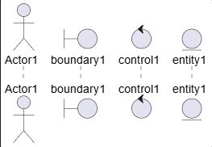
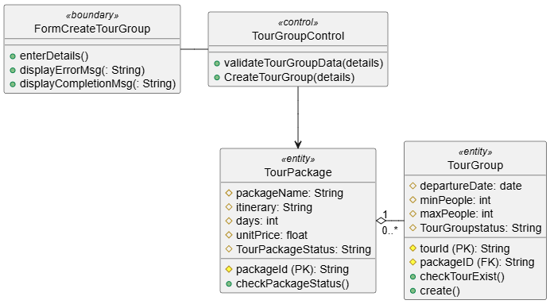
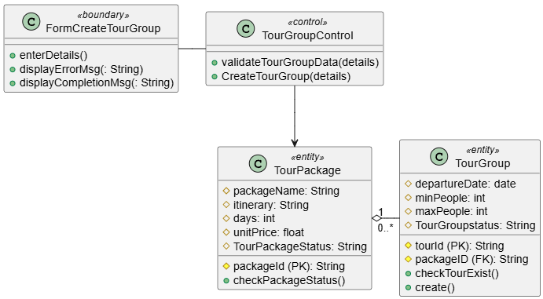
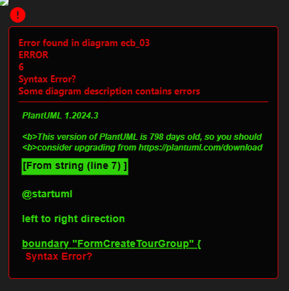
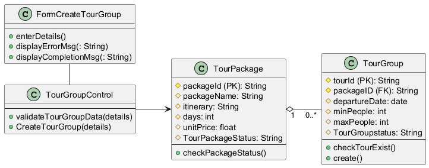
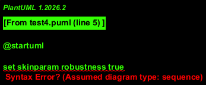
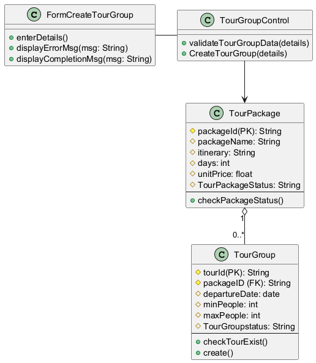
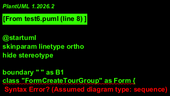

# How to Show `Boundary`, `Control` and `Entity` Icons in Class Diagram? (PlantUML)

I got this question and thought it would be quite simple and straighforward initially, while, when trying to replicate the diagramming, I found there're certain PlantUML version & syntax / grammer constraints, finally I can only re-produce in the ~90% alike diagram. This article aims to document my quick journey on all kinds of tries, while it's also one good chance of learning!

- [How to Show `Boundary`, `Control` and `Entity` Icons in Class Diagram? (PlantUML)](#how-to-show-boundary-control-and-entity-icons-in-class-diagram-plantuml)
  - [Background of the Question](#background-of-the-question)
  - [Analysis of the Diagram](#analysis-of-the-diagram)
    - [Analyze Notations in PlantUML](#analyze-notations-in-plantuml)
  - [Try 01: Normal Way by Using Stereotypes.](#try-01-normal-way-by-using-stereotypes)
  - [Try 02: Use "Robustness" shapes](#try-02-use-robustness-shapes)
  - [Try 03: Try to Replace Class Boxes with Shapes](#try-03-try-to-replace-class-boxes-with-shapes)
  - [Try 04: Hide Stereotypes and Expect to Show Icons](#try-04-hide-stereotypes-and-expect-to-show-icons)
  - [Try 05: `skinparam robustness` Command](#try-05-skinparam-robustness-command)
  - [Try 06: Fix Issue Caused by `set skinparam robustness true`](#try-06-fix-issue-caused-by-set-skinparam-robustness-true)
  - [Try 07: Using `skinparam linetype ortho` for Icon Displaying](#try-07-using-skinparam-linetype-ortho-for-icon-displaying)

## Background of the Question

Raised by [Kok Leong Ang](https://www.udemy.com/user/kok-leong-ang/): can PlantUML create the class diagram with Entity, Boundary and Control?

Attached the diagram is as below:



## Analysis of the Diagram

Robustness diagrams are written after use cases and before class diagrams.

The question relates to one robustness diagram, including 4 elements in 3 types of the objects:

- Boundary x 1: `FormCreateTourGroup`
- Control x 1: `TourGroupControl`
- Entity x 2 ("TouPackage" is aggregated by "TourGroup")
  - `TourPackage`
  - `TourGroup`

They're also known as Robustness diagram symbols, which help to identify the roles of use case steps and represent usage requirements for the system which are building.

Whereas the Model-View-Controller (MVC) pattern is used for user interfaces, the Entity-Control-Boundary Pattern (ECB) is used for systems.



More information on those objects:
- Entities (model): Objects representing system data, often from the domain model.
- Boundaries (view/service collaborator): Objects that interface with system actors (e.g. a user or external service). Windows, screens and menus are examples of bouindaries that interface with users.
- Controls (controller): Objects that mediate between boundaries and entities. These serve as the glue between boundary elements and entity elements, implementing the logic required to manage the various elements and their interactions. It is important to understand that you may decide to implement controllers within your design as something other than objects - many controllers are simple enough to be implemented as a method of an entity or boundary class for example.

There're 4 rules applying to their communication (adding `Actor` into the context):

1. `Actors` can only talk to `boundary objects`
2. `Boundary objects` can only talk to `controllers` and `actors`
3. `Entity objects` can only talk to `controllers`
4. `Controllers` can talk to `boundary objects` and `entity objects`, and to other `controllers`, but not to `actors`

As below allowed-communication matrix:

| | Entity | Boundary | Controller |
| --- | :---: | :---: | :---: |
| Entity | X | | X |
| Boundary | | | X |
| Controller | X | X | X |

Actually, the **Robustness Diagrams** (or Analysis Diagrams, as they are sometimes called) are just speciflized **Class Diagrams**. 

### Analyze Notations in PlantUML

From diagram in the question, it have certain visibility indicators for methods or fields, below are the four definitions available in PlantUML `Class Diagram`:

| Character | Icon for Field | Icon for Method | Visibility |
| :---: | :---: | :---: | :---: |
| - | <span style="color:red;">&#9633;</span> (\&#9633;) | <span style="color:red;">&#9632;</span> (\&#9632;) | private |
| # | <span style="color:goldenrod;">&#9671;</span> (\&#9671;) | <span style="color:gold;">&#9670;</span> (\&#9670;) | private |
| ~ | <span style="color:blue;">&#9651;</span> (\&#9651;) | <span style="color:blue;">&#9650;</span> (\&#9650;) | private |
| + | <span style="color:green;">&#9675;</span> (\&#9675;) | <span style="color:green;">&#9679;</span> (\&#9679;) | private |

The way to diagramming the relations between classes are as below:

| Type | Symbol | Drawing |
| :---: | :---: | :---: |
| Extension | <\|-- | <span style="color:#b00020;">◁────</span><br> |
| Composition | *-- | <span style="color:#b00020;">◆────</span><br> |
| Aggregation | o-- | <span style="color:#b00020;">◇────</span> |

While, those objects are the declared participant in `Sequence Diagram`:

```
@startuml
actor Actor1
boundary boundary1
control control1
entity entity1
@enduml
```



In PlantUML logic, if you just define as `boundary boundary1`, it is default rendered as a Sequence Diagram, so you see the icon in both top and bottom of the sequence indicating line. While, the good thing is the big icons are shown correctly.

So, the question can be re-stated as

- Define in Class Diagram with showing ECB objects as big icons, or
- In Sequence like diagram, with EBC object icons defined (we only need one set, not two), show the box with class properties

Following are the steps by steps practice to find the closest way for drawing the expected diagram:

---

## Try 01: Normal Way by Using Stereotypes.

I say Normal Way, since when I create a PlantUML Class Diagram with using certain notations like `Entity`, `Boundary`, and `Control`, I nomrally use specific stereotypes.

PlantUML will automatically render those stereotypes, code as below

```
@startuml
' filename: ecb_01

skinparam style strictuml

' --- Definitions ---

class "FormCreateTourGroup" <<boundary>> {
    + enterDetails()
    + displayErrorMsg(: String)
    + displayCompletionMsg(: String)
}

class "TourGroupControl" <<control>> {
    + validateTourGroupData(details)
    + CreateTourGroup(details)
}

class "TourPackage" <<entity>> {
    # packageId (PK): String
    # packageName: String
    # itinerary: String
    # days: int
    # unitPrice: float
    # TourPackageStatus: String
    + checkPackageStatus()
}

class "TourGroup" <<entity>> {
    # tourId (PK): String
    # packageID (FK): String
    # departureDate: date
    # minPeople: int
    # maxPeople: int
    # TourGroupstatus: String
    + checkTourExist()
    + create()
}

' --- Relationships ---

"FormCreateTourGroup" - "TourGroupControl"
"TourGroupControl" --> "TourPackage"
"TourPackage" "1   " o-right- "      0..*" "TourGroup"

@enduml
```



Code file: [ecb_01.puml](ecb_01.puml)

Reflection:

1. My practice of illustrating ECB objects are via stereotypes, however, this means the objects are just shown as text wrapped inside the « and », not the expected big icons -- so it's not fulfilled the need
2. As the four elements are all defined as `class`, the grouping of lines below the name are Fields above Methods, e.g. `# packageId (PK): String` is recognized as method, so it's not shown in the top of the `TourPackage`, but in the method group
3. You cannot simply extend the length of aggregation relation, so here using a trick with adding some dummy spaces as `"1   "`, which resulting the `0..*` is sitting in the second line

## Try 02: Use "Robustness" shapes

As the stereotypes are not the expected display result, try to use another `skinparam` command to change default behavior of stereotypes.

Target is to use "Robustness" shapes (the circles with specific icons) instead of standard class boxes.

Description of the "Robustness" shapes:
   - boundary: circle with the "T-bar" line on the left
   - control: circular arrow symbol used for logic components
   - entity: circle with the flat base line

```
@startuml
' filename: ecb_02

' This command tells PlantUML to use EBC object shapes for those stereotypes
skinparam folder {
    BackgroundColor White
} 

' --- Defining classes with specific stereotypes ---

class "FormCreateTourGroup" <<boundary>> {
    + enterDetails()
    + displayErrorMsg(: String)
    + displayCompletionMsg(: String)
}

class "TourGroupControl" <<control>> {
    + validateTourGroupData(details)
    + CreateTourGroup(details)
}

class "TourPackage" <<entity>> {
    # packageId (PK): String
    # packageName: String
    # itinerary: String
    # days: int
    # unitPrice: float
    # TourPackageStatus: String
    + checkPackageStatus()
}

class "TourGroup" <<entity>> {
    # tourId (PK): String
    # packageID (FK): String
    # departureDate: date
    # minPeople: int
    # maxPeople: int
    # TourGroupstatus: String
    + checkTourExist()
    + create()
}

' --- Relationships ---

"FormCreateTourGroup" - "TourGroupControl"
"TourGroupControl" --> "TourPackage"
"TourPackage" "1   " o-right- "      0..*" "TourGroup"

@enduml
```



Source Code: [ecb_02.puml](./ecb_02.puml)

Reflection:

1. We keep using "Auto-Layout" since PlantUML will attempt to keep the attributes and methods in a box attached below the symbol
2. This code doesn't show icon symbol, the class box is still the notation

## Try 03: Try to Replace Class Boxes with Shapes

To replace the standard class boxes with the actual `**Boundary**`, `**Control**` and `**Entity**` shapes, consider to use specific keywords `boundary`, `control` and `entity` instead of the word `class`, hope PlantUML treats them as specialized types (as used in above Sequence Diagram).

```
@startuml
' filename: ecb_03

' Forces the icons to be used instead of boxes with text stereotypes
left to right direction

boundary "FormCreateTourGroup" {
    + enterDetails()
    + displayErrorMsg(: String)
    + displayCompletionMsg(: String)
}

control "TourGroupControl" {
    + validateTourGroupData(details)
    + CreateTourGroup(details)
}

entity "TourPackage" {
    # packageId (PK): String
    # packageName: String
    # itinerary: String
    # days: int
    # unitPrice: float
    # TourPackageStatus: String
    --
    + checkPackageStatus()
}

entity "TourGroup" {
    # tourId (PK): String
    # packageID (FK): String
    # departureDate: date
    # minPeople: int
    # maxPeople: int
    # TourGroupstatus: String
    --
    + checkTourExist()
    + create()
}

' --- Relationships ---

"FormCreateTourGroup" - "TourGroupControl"
"TourGroupControl" --(0 "TourPackage" : uses >
"TourPackage" "1" o-- "0..*" "TourGroup"

@enduml
```

These's error happened and the diagram cannot display:



Source code: [ecb_03.puml](./ecb_03.puml)

Reflections:

1. By using `boundaary Name { ... }` instead of `class Name «bounday»`, expect PlantUML to prioritize the visual symbol as the primary header
2. Since the diagram is not using `class`, add separator `--` inside the entities to create a horizontal line to separate the "Attributes" from the "Methods", which helps organize the data-heavy Entity shapes.
3. Use "Lollipop" connection `--(0` between Control and Entity to simulate a "socket" or interface-style connection, can still use standard arrow `-->`
4. However, the error (`Assumed diagram type: class`), possible reason could be: in older version or specific configurations of PlantUML, the `boundary`, `control` and `entity` keywords don't support the curly bracket `{}` block syntax for members (attributes and methods) like the `class` keyword does.

## Try 04: Hide Stereotypes and Expect to Show Icons

Define the members using a **stereotype** but tell PlantUML to hide the text and expect only icon will be shown.

Although the "E" is normally used in E-R Diagram, we can use it instead of `Class" to show the big "E" with a circle.

```
@startuml
' filename: ecb_04

' This ensures only the icons are shown, not the «stereotyp» text
hide stereotypes
left to right direction

class "FormCreateTourGroup" <<boundary>> {
    --
    + enterDetails()
    + displayErrorMsg(: String)
    + displayCompletionMsg(: String)
}

class "TourGroupControl" <<control>> {
    --
    + validateTourGroupData(details)
    + CreateTourGroup(details)
}

class "TourPackage" <<entity>> {
    # packageId (PK): String
    # packageName: String
    # itinerary: String
    # days: int
    # unitPrice: float
    # TourPackageStatus: String
    --
    + checkPackageStatus()
}

class "TourGroup" <<entity>> {
    # tourId (PK): String
    # packageID (FK): String
    # departureDate: date
    # minPeople: int
    # maxPeople: int
    # TourGroupstatus: String
    --
    + checkTourExist()
    + create()
}

' --- Relationships ---

"FormCreateTourGroup" - "TourGroupControl"
"TourGroupControl" --> "TourPackage"
"TourPackage" "1   " o-- "      0..*" "TourGroup"

@enduml
```



Source code: [ecb_04.puml](./ecb_04.puml)

Reflections:

- Using `PlantUML.jar` can generate correct result with stereotypes are hided, while the PlanUML Previewer plug-in in VS Code still have stereotypes
- `class ... <<stereotype>>` is the most stable syntax for adding methods and attributes
- `hide stereotypes` hides the text (e.g., it removes the word `«boundary»` from the diagram) but keep the specific circular icon
- The separator line `--` can help to ensure the sequence of the Attributes/Methods are follow the order in the code, no automatically adjustment
- However, it's still not showing the icon, class boxes are shown

## Try 05: `skinparam robustness` Command

Consider the way to get the circle icon for those Robustness/EBC notation while still showing the class box underneath, try using `skinparam robustness` command, this is the specific "mode" in PlantUML that tells it to render those stereotypes as the icons.

```
@startuml
' filename: ecb_05

' Enable the specialized Robustness icons
set skinparam robustness true
hide stereotypes

class "FormCreateTourGroup" <<boundary>> {
    --
    + enterDetails()
    + displayErrorMsg(: String)
    + displayCompletionMsg(: String)
}

class "TourGroupControl" <<control>> {
    --
    + validateTourGroupData(details)
    + CreateTourGroup(details)
}

class "TourPackage" <<entity>> {
    # packageId (PK): String
    # packageName: String
    # itinerary: String
    # days: int
    # unitPrice: float
    # TourPackageStatus: String
    --
    + checkPackageStatus()
}

class "TourGroup" <<entity>> {
    # tourId (PK): String
    # packageID (FK): String
    # departureDate: date
    # minPeople: int
    # maxPeople: int
    # TourGroupstatus: String
    --
    + checkTourExist()
    + create()
}

' --- Relationships ---

"FormCreateTourGroup" - "TourGroupControl"
"TourGroupControl" --> "TourPackage"
"TourPackage" "1   " o-- "      0..*" "TourGroup"

@enduml
```



Source code: [ecb_05.puml](./ecb_05.puml)

Reflection:

- `set skinparam robustness true`: override the standard boxy class look for any class tagged with `«boundary»`, `«control»`, or `«entity»` and uses the circular EBC symbols instead
- While, the error pops up, possible due to the version of PlantUML being a bit picky about the `set` prefix and the `skinparam` syntax.
  - In many PlantUML versions, `skinparam` doesn't use the work `set` at the beginning, and `robustness` is a style choice rather than a simple true/false toggle.
- `hide stereotypes`: cleans up the diagram so the text "<<control>>" will not be seen floating inside the circle, should just show the name

## Try 06: Fix Issue Caused by `set skinparam robustness true`

As the `set` prefix is not supported, so change to one alternative way `skinparam style ...`

```
@startuml
' filename: ecb_06

' Use "skinparam style robustness" to force the EBC shapes
skinparam style robustness
hide stereotypes

class "FormCreateTourGroup" <<boundary>> {
    --
    + enterDetails()
    + displayErrorMsg(: String)
    + displayCompletionMsg(: String)
}

class "TourGroupControl" <<control>> {
    --
    + validateTourGroupData(details)
    + CreateTourGroup(details)
}

class "TourPackage" <<entity>> {
    # packageId (PK): String
    # packageName: String
    # itinerary: String
    # days: int
    # unitPrice: float
    # TourPackageStatus: String
    --
    + checkPackageStatus()
}

class "TourGroup" <<entity>> {
    # tourId (PK): String
    # packageID (FK): String
    # departureDate: date
    # minPeople: int
    # maxPeople: int
    # TourGroupstatus: String
    --
    + checkTourExist()
    + create()
}

' --- Relationships ---

"FormCreateTourGroup" - "TourGroupControl"
"TourGroupControl" --> "TourPackage"
"TourPackage" "1   " o-- "      0..*" "TourGroup"

@enduml
```



Source code: [ecb_06.puml](./ecb_06.puml)

Reflections:

- `skinparam style robustness`: still not show the expected result
- `hide stereotypes`: as expected, the stereotypes are hidden now

## Try 07: Using `skinparam linetype ortho` for Icon Displaying

Since in above code, my current version of PlantUML (1.2026.2) seems to be struggling with the `style robustness` command, try an alternative "Layout Trick`.

And, define the **Icon** and the **Class Box** as two separate elements and link them with one hidden line, try to build the diagram with mixed style.

```
@startuml
' filename: ecb_07

' This hides the line between the icon and the box to make them look like one piece
skinparam linetype ortho
hide stereotypes

' --- Boundary ---
boundary " " as B1
class "formCreateTourGroup" as Form {
    --
    + enterDetails()
    + displayErrorMsg(: String)
    + displayCompletionMsg(: String)
}
B1 -[hidden]- Form

' --- Control ---
control " " as C1
class "TourGroupControl" as Control {
    --
    + validateTourGroupData(details)
    + CreateTourGroup(details)
}
C1 -[hidden]- Control

' --- Entity 1 ---
entity " " as E1
class "TourPackage" as Package {
    # packageId (PK): String
    # packageName: String
    # itinerary: String
    # days: int
    # unitPrice: float
    # TourPackageStatus: String
    --
    + checkPackageStatus()
}
E1 -[hidden]- Package

' --- Entity 2 ---
entity " " as E2
class "TourGroup" as Group {
    # tourId (PK): String
    # packageID (FK): String
    # departureDate: date
    # minPeople: int
    # maxPeople: int
    # TourGroupstatus: String
    --
    + checkTourExist()
    + create()
}
E2 -[hidden]- Group

' --- Relationships ---

Form - Control
Control --> Package
Package "1" o-- "0..*" Group

@enduml
```



Source code: [ecb_07.puml](./ecb_07.puml)

