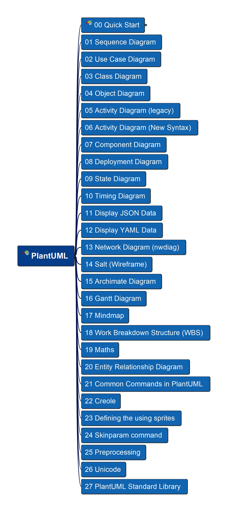
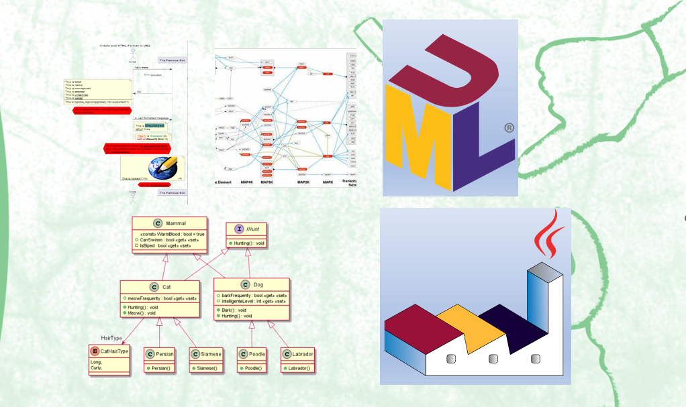

# PlantUML in Action

<!-- 
   -->

<!--  -->

---

Learning and practice PlantUML languange and its modeling

## Content Structure

## Videos/Course on Diagramming Practice

[Video List on YouTube](https://www.youtube.com/playlist?list=PL6DEHvciXKeVpviuszy0l3yVIlhEFA4Sy)

For access full contents without waiting publishing gradually in YouTube, welcome to subscribe my packaged course in Udemy - 

thanks for your supporting and appreciation to my work!

---

Welcome to get your questions or comments, let's make PlantUML more practical together, feel free to post in [Discusstion Board](https://github.com/yasenstar/PlantUML_in_Action/discussions) or send me [Email](mailto:xiaoqizhao@outlook.com?subject=About_PlantUML), good luck!