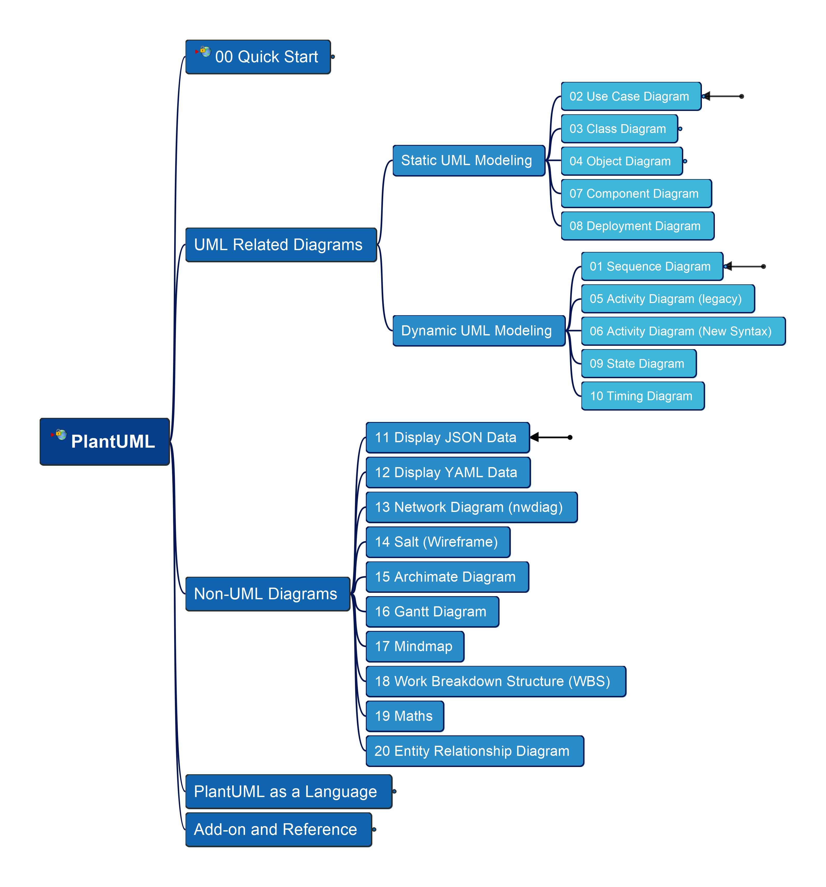

# PlantUML in Action

---

Learning and practice PlantUML languange and its modeling

|||
|---|---|

## Videos/Course on Diagramming Practice

[Video List on YouTube](https://www.youtube.com/playlist?list=PL6DEHvciXKeVpviuszy0l3yVIlhEFA4Sy)

For access full contents without waiting publishing gradually in YouTube, welcome to subscribe my packaged course in Udemy - 

From Udemy published, you may view and learn this in structured course manner, and get certificate for your completion of the learning, welcome to visit [this course in Udemy](https://www.udemy.com/course/plantuml-in-action/?referralCode=D34C45B9FC7D631C0196) and enroll, thanks for your supporting and appreciation to my work!

You can learn [What's New?](https://plantuml.com/news) from PlantUML homepage, thanks for Arnaud's encouragement and posting my practices in the page. It's my pleasure that I can have chance to contribute back to the community!

---

Welcome to get your questions or comments, let's make PlantUML more practical together, feel free to post in [Discusstion Board](https://github.com/yasenstar/PlantUML_in_Action/discussions) or send me [Email](mailto:xiaoqizhao@outlook.com?subject=About_PlantUML), good luck!

Last Updated at: 12/31/2025, 1:05:25 PM 